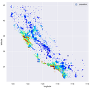
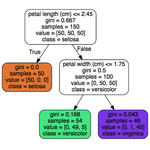
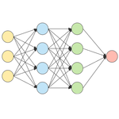
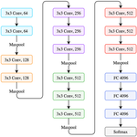
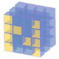

# Machine Learning Handbook

This repository contains theorical explanations and Python-based demonstrations for various Machine Learning concepts, techniques and tools. Practical challenges can be found in the associated [Machine Learning Katas](https://github.com/bpesquet/machine-learning-katas) repository.

 Explanations and demos are gathered into [Jupyter](https://jupyter.org/) notebooks that can be rendered either:

- locally, by cloning or downloading this repository then spinning up a Jupyter notebook server on your local machine.
- online, through [nbviewer](https://nbviewer.jupyter.org) (in read-only mode), [binder](https://mybinder.org) or [Colaboratory](https://colab.research.google.com) (Google account needed).

> This material is part of the Machine Learning course taught at [ENSC](https://ensc.bordeaux-inp.fr). [ENSEIRB-MATMECA](https://enseirb-matmeca.bordeaux-inp.fr) and [IOGS](https://www.institutoptique.fr).

## Workflow

||Title|Rendering options|
|-|-|-|
||[Machine Learning In Action](notebooks/workflow/machine_learning_in_action.ipynb)|  |
||[Machine Learning Fundamentals](notebooks/workflow/machine_learning_fundamentals.ipynb)|  |

## Models

||Title|Rendering options|
|-|-|-|
||[Decision Trees & Random Forests](notebooks/models/decision_trees_and_random_forests.ipynb)|  |
||[Artificial Neural Networks](notebooks/models/artificial_neural_networks.ipynb)|  |
||[Convolutional Neural Networks](notebooks/models/convolutional_neural_networks.ipynb)|  |

## Tools

||Title|Rendering options|
|-|-|-|
||[Python](notebooks/tools/python.ipynb)|  |
||[NumPy](notebooks/tools/numpy.ipynb)|  |
||[pandas](notebooks/tools/pandas.ipynb)|  |
||[Matplotlib & Seaborn](notebooks/tools/matplotlib.ipynb)|  |
||[scikit-learn](notebooks/tools/scikit-learn.ipynb)|  |

## Older material

- K-Nearest Neighbors [ [Overview](https://www.bpesquet.fr/en/slides/ai/k-nearest-neighbors/) | [Demo](notebooks/models/knn.ipynb) ]
- Linear Regression [ [Overview](https://www.bpesquet.fr/en/slides/ai/linear-regression/) | [Demo](https://playground.tensorflow.org/#activation=tanh&batchSize=10&dataset=circle&regDataset=reg-plane&learningRate=0.03&regularizationRate=0&noise=25&networkShape=&seed=0.27079&showTestData=false&discretize=false&percTrainData=50&x=true&y=true&xTimesY=false&xSquared=false&ySquared=false&cosX=false&sinX=false&cosY=false&sinY=false&collectStats=false&problem=regression&initZero=false&hideText=false&showTestData_hide=false&activation_hide=true&noise_hide=false&discretize_hide=true&dataset_hide=true&batchSize_hide=true&percTrainData_hide=true&numHiddenLayers_hide=true&problem_hide=true) ]
- Logistic Regression [ [Overview](https://www.bpesquet.fr/en/slides/ai/logistic-regression/) | [Demo](https://playground.tensorflow.org/#activation=sigmoid&batchSize=10&dataset=gauss&regDataset=reg-plane&learningRate=0.03&regularizationRate=0&noise=0&networkShape=&seed=0.61489&showTestData=false&discretize=false&percTrainData=50&x=true&y=true&xTimesY=false&xSquared=false&ySquared=false&cosX=false&sinX=false&cosY=false&sinY=false&collectStats=false&problem=classification&initZero=false&hideText=false&numHiddenLayers_hide=true&percTrainData_hide=true&discretize_hide=true&problem_hide=true&activation_hide=true) ]
- PyTorch [ [Overview](https://www.bpesquet.fr/en/slides/ai/pytorch/) | [Demo](notebooks/tools/pytorch.ipynb) ]
- Generative Adversarial Networks [ [Overview](https://www.bpesquet.fr/en/slides/ai/generative-deep-learning/) ]
